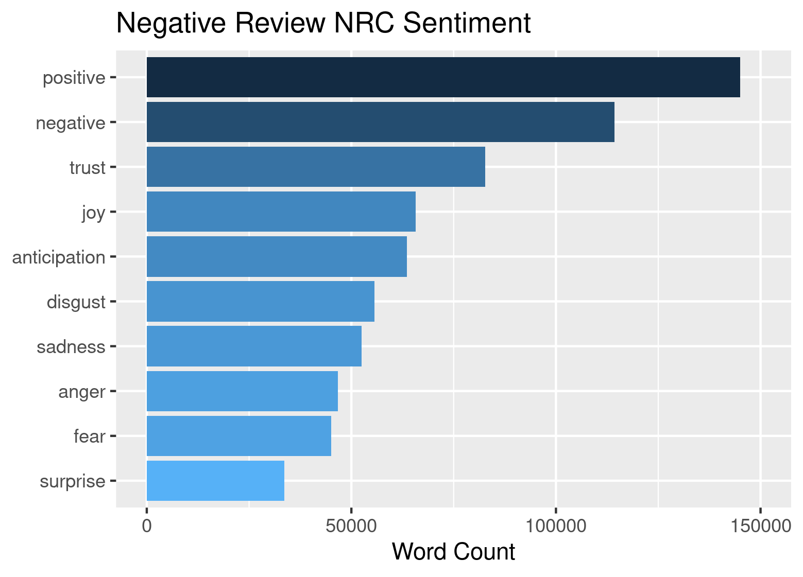

BIOS611 Project1
========================================
Food Review Analysis
-------------------------------------------
Proposal
-------------------------------------------
Introduction
-------------------------------------------

The project including an analysis of the food review in Amazon, the dataset consists of half a million Amazon food reviews and was originally published by SNAP.

Please go to the website below to retrieve the data
===================================================
## For the amazon food review:
reviews.csv:
https://www.kaggle.com/snap/amazon-fine-food-reviews
## For the rest:
All_beauty_5.json: 
http://deepyeti.ucsd.edu/jianmo/amazon/categoryFilesSmall/All_Beauty_5.json.gz
  
Movie_and_TV_5.json:
http://deepyeti.ucsd.edu/jianmo/amazon/categoryFilesSmall/Movies_and_TV_5.json.gz
  
Sports_and_outdoors_5.json:
http://deepyeti.ucsd.edu/jianmo/amazon/categoryFilesSmall/Sports_and_Outdoors_5.json.gz
  
Video_Games_5.json:
http://deepyeti.ucsd.edu/jianmo/amazon/categoryFilesSmall/Video_Games_5.json.gz

### Some interesting avenues of expolrations on it include:
1. what does the review score distribution look like?
2. Does the review score relate to the review length?
3. Does the review score relate to the sentiment of the review?
4. What words tend to indicate positive and negative review?
5. Can we tell the topic of the review by machine learning? 

Text Mining and Exploratory Analysis
------------------------------------------
First, we make thea histogram of Amazon food review score from 1-5.

Then, we makes a histogram of Amazon food review helpfulness distribution.

After having a general desctription figure,we further analyze the length of the reviews.

popular words by review scores.

lexical density of the reviews by scores

and lexical diversity of reviews by scores

and TF-IDF to discover the most unique words in the reviews by scores

Positive or Negative? Upset or pleased? Sentiment Explore
------------------------------------------
Machine can't understand reviews but can in some-ways define the sentiment of the review.
Here we use the r library tidytext to "teach" the "machine" to understand the reviews.
Here are the same words that the review and the sentiment database has shared

Using the database "bing" we found that most of the words in our review are positive.

Using the database "nrc" here are the top sentiments in general reviews and positive and negative reviews

Music?Movie?or Food? Topic prediction
--------------------------------------------
This section will use LDA model and k-means to predict the topic of the reviews.
The 
The LDA is a special machine learning tool designed for natural language processing, the LDA shows great result to predict the topic by the reviews.
K-means is a general clustering tools to cluster the indicators, here the K-means does not lead to satisfying result.

Usage
-------------------------------------------

you will need Docker and the ability to run Docker as your current user.

    >docker build . -t project1
    >docker run -v 'pwd':/home/rstudio -p 8787:8787 -e PASSWORD=mypassword -i project1
    
Then connect to the machine on port 8787.

Makefile
-------------------------------------------
Makefile shows the organization of the project.
Enter through terminal or Rstudio.

    >Make example-folder/example-image.png
    >Make example-folder/example-dataset.csv
