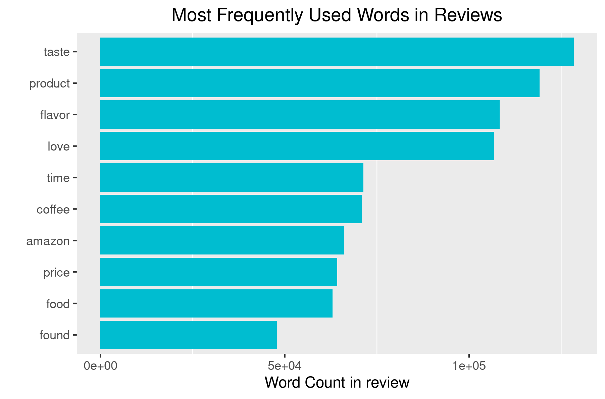
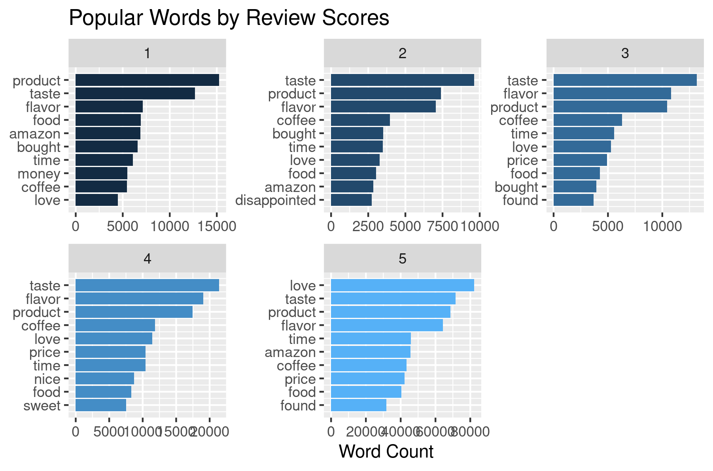
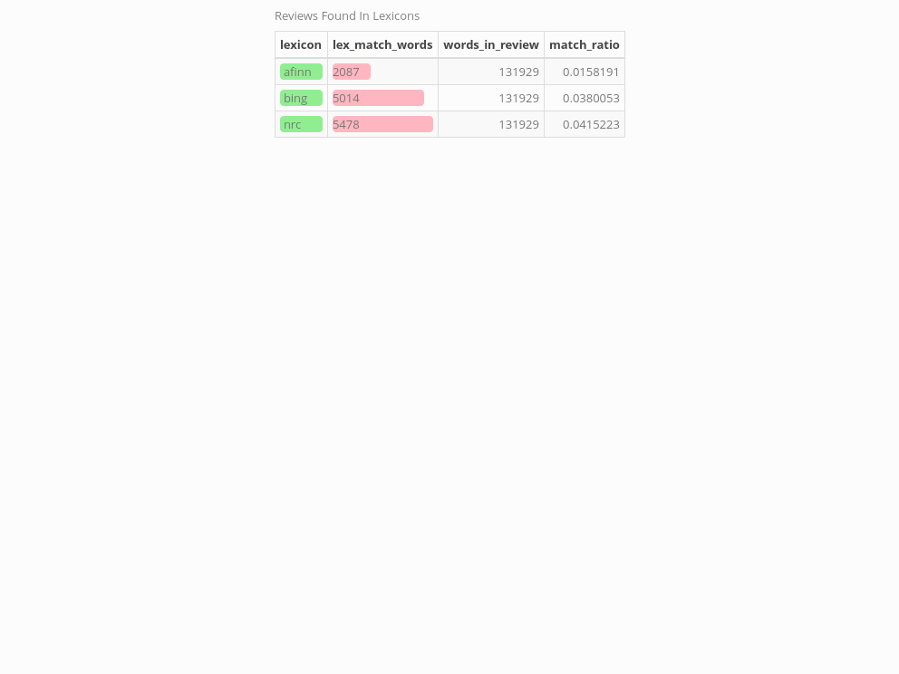

```{r setup, include=FALSE}
knitr::opts_chunk$set(echo = TRUE)
```
# Introduction

The purpose of this project is to discover if there is strong sentimental difference between the positive and negative reviews. And if we can use machine learning to let the computer to detect the topic of reviews.

We found there are significant sentimental difference between the negative and positive review, and the machine help us to detect the topic 4 in 5 time correct. Not bad!

# Dataset

The data set comes from Kaggle: https://www.kaggle.com/snap/amazon-fine-food-reviews
This dataset contains Amazon fine food review, including around 500,000 reviews from Amazon Oct 1999 - Oct 2012

and UCSD:
http://jmcauley.ucsd.edu/data/amazon/
The dataset contains product review and metadata from Amazon  May 1996 - July 2014.

# Data Overview

The food review overview shows the distribution of food review score and helpfulness score. The food review have mainly positive review but less help in general.

<center>
{ width=50% }
</center>

# Review Length

Top 20 review length and summary. It is very surprising that so many summary has length over 1000

\newpage

Least 20 Review Length and Summary from Amazon food review. The number 61 comes form the review limitation. 


\newpage

Review length distribution by score

The higher the score, the longer the review could be.


Do does the length relate to the score in the statistical sense?We conduct ANOVA here and found significant association between these two ( p-value: < 2.2e-16)!

```{r ANOVA}
library(tidyverse)
full_word_count<-read_csv("derived_data/full_word_count.csv")
anova<-lm(score~num_words,data = full_word_count)
summary(anova)
```

# Popular Words in the reviews

The most 10 popular words in the all reviews are below:we can found many words used to describe the food such as flavor,taste!

<center>
{ width=50% }
</center>

By scores,the populor words are not quiet different from each other. The word :taste,flavor, amazon, food are very common in all the review score.
<center>

</center>

# Sentiment analysis

Here start the fun staff, the question is: can we tell the sentimental difference between the negative and positive review?

R has three sentimental database: Bing,nrc and afinn, they are very different on their own way of defining sentiment. The Bings dataset split the words into negative and positive category. The NRC datase split the words into more detailes like angry, upset, fear...The afinn dataset have a numeric database to decribe the positiveness and negativeness.

Here are the overlap between our data and three database we mentioned.


The NRC and bing database has more than five thousand overlap and afinn has over 2000 overlap.
From the Bing sentiment database, we get the following result.
<center>

</center>

The result shows that positive review has more positive words than negative words. While the negative review has more negative words than positive.

\newpage

From the nrc database analysis, we get:
<center>

</center>
It is little strange to see positive sentiment in the negative report.But we can see many negative sentiment are higher in the lower score compared to the score=5.

\newpage

# Topic analysis

This last part are a little train to see if the computer can tell the topic of reviews.Adding to the origin food review, we use the review from Beauty, Outdoor, movieTV, VideoGame. 
The analysis we use is called LDA and k-means, they are widely used in the natural language processing. LDA is a short for latent Dirichlet allocation, if observations are words collected into documents, it posits each document is a mixture of a small number of topics and that each word's presence is attributable to one of the document's topics. 

By LDA and k-means topic modeling, top five topic we can distinguish the 4 out of 5!

<center>
{ width=50% }
\newpage
k-means is a clustering method used to partition observations into k clusters, it is hard for us to tell the accuracy. 

{ width=50% }
</center>


